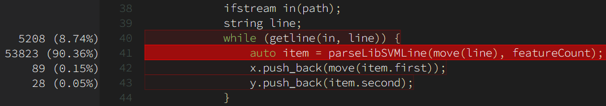
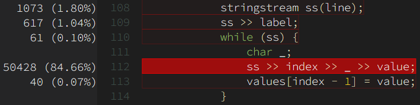
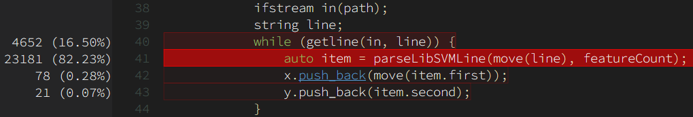
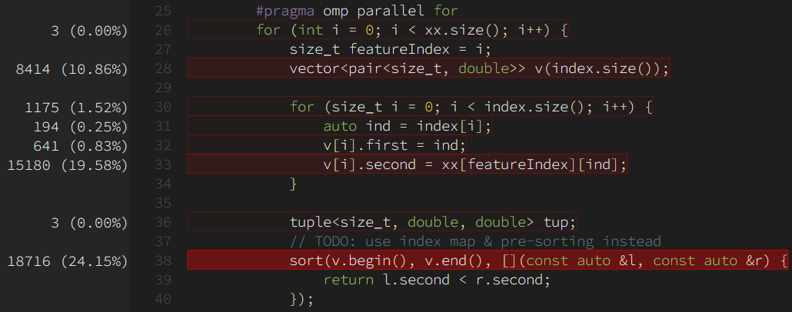
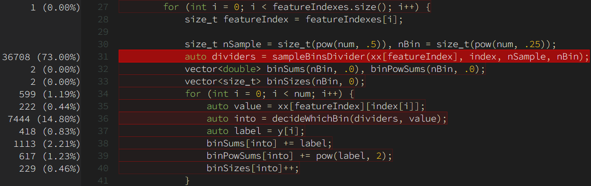
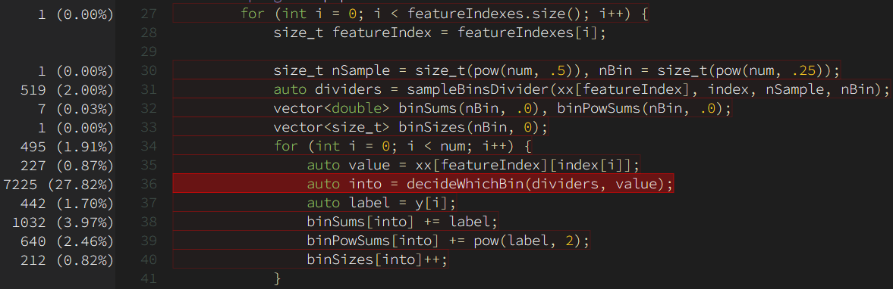

# Gradient Boosting Decision Tree

## 1. 构建与使用

### 1.1 构建

* Windows: 使用 Visual Studio 2017 打开解决方案并生成即可。
* Linux: 根目录提供了 `makefile` 文件，使用 `make` 编译即可，需要 `gcc >= 5.4.0`

### 1.2 使用

* 用法：`boost <config_file> <train_file> <test_file> <predict_dest>`

* 接受 LibSVM 格式的训练数据输入，如下每行代表一个训练样本：

  ```
  <label> <feature-index>:<feature-value> <feature-index>:<feature-value> <feature-index>:<feature-value>
  ```

* 用于预测的数据输入和训练数据类似：

  ```
  <id> <feature-index>:<feature-value> <feature-index>:<feature-value> <feature-index>:<feature-value>
  ```

* **目前只支持二分类问题**

* `<config_file>` 指定训练参数：

  ```
  eta = 1.                 # shrinkage rate
  gamma = 0.               # minimum gain required to split a node
  maxDepth = 6             # max depth allowed
  minChildWeight = 1       # minimum allowed size for a node to be splitted
  rounds = 1               # REQUIRED. number of subtrees
  subsample = 1.           # subsampling ratio for each tree
  colsampleByTree = 1.     # tree-wise feature subsampling ratio
  maxThreads = 1;          # max running threads
  features;                # REQUIRED. number of features
  validateSize = .2        # if greater than 0, input data will be split into two sets and used for training and validation repectively
  ```

## 2. 算法原理

GBDT 的核心可以分成两部分，分别是 Gradient Boosting 和 Decision Tree:

* Decision Tree : GBDT 的基分类器，通过划分输入样本的特征使得落在相同特征的样本拥有大致相同的 label。由于在 GBDT 中需要对若干不同的 Decision Tree 的结果进行综合，因此一般采用的是 Regression Tree （回归树）而不是 Classification Tree （分类树）。
* Gradient Boosting: 迭代式的集成算法，每一棵决策树的学习目标 y 都是之前所有树的结论和的残差（即梯度方向），也即 $y_i=y-\sum_{j=0}^{i-1}{\hat{y_j}}$ 。

## 3. 实现与优化历程

各个部分的实现均经过若干次“初版实现 - 性能 profiling - 优化得到下一版代码”的迭代。其中，性能 profiling 部分，使用的是 Visual Studio 2017 的“性能探查器”功能，在进行性能 profile 之前均使用 release 模式编译（打开`/O2 /Oi`优化选项）。

### 3.1 数据处理

选择的输入文件数据格式是 Libsvm 的格式，格式如下：

```
<label> <feature-index>:<feature-value> <feature-index>:<feature-value>
```

可以看到这种格式天然适合用来表示稀疏的数据集，但在实现过程中，为了简单起见以及 cache 性能，我通过将空值填充为 0 转化为密集矩阵形式存储。代价是内存占用会相对高许多。

#### 3.1.1 初版

最初并没有做什么优化，采用的是如下的简单流程：

* 文件按行读取
* 对于每一行内容，先转成 `std::stringstream`，再从中解析出相应的数据。

核心代码如下：

```cpp
ifstream in(path);
string line;
while (getline(in, line)) {
    auto item = parseLibSVMLine(move(line), featureCount); // { label, vector }
    x.push_back(move(item.first));
    y.push_back(item.second);
}

/* in parseLibSVMLine */
stringstream ss(line);
ss >> label;
while (ss) {
    char _;
    ss >> index >> _ >> value;
    values[index - 1] = value;
}
```

**profile 结果：**



可以看到，主要的耗时在于将一行字符串解析成我们需要的 label + vector 数据这一过程中，进一步分析：



因此得知主要问题在于字符串解析部分。此时怀疑是 `std::stringstream` 的实现为了线程安全、错误检查等功能牺牲了性能，因此考虑使用 `cstdio` 中的实现。

#### 3.1.2 改进

将 `parseLibSVMLine` 的实现重写，使用`cstdio` 中的`sscanf` 代替了 `std::stringstream`：

```cpp
int lastp = -1;
for (size_t p = 0; p < line.length(); p++) {
    if (isspace(line[p]) || p == line.length() - 1) {
        if (lastp == -1) {
            sscanf(line.c_str(), "%zu", &label);
        }
        else {
            sscanf(line.c_str() + lastp, "%zu:%lf", &index, &value);
            values[index - 1] = value;
        }
        lastp = int(p + 1);
    }
}
```

**profile 结果：**



可以看到，虽然 parse 部分仍然是计算的热点，但这部分的计算量显著下降（53823 -> 23181），读取完整个数据集的是时间减少了 50% 以上。

#### 3.1.3 最终版

显然，在数据集中，每一行之间的解析任务都是相互独立的，因此可以在一次性读入整个文件并按行划分数据后，对数据的解析进行并行化：

```cpp
string content;
getline(ifstream(path), content, '\0');
stringstream in(move(content));

vector<string> lines;
string line;
while (getline(in, line)) lines.push_back(move(line));

#pragma omp parallel for
for (int i = 0; i < lines.size(); i++) {
    auto item = parseLibSVMLine(move(lines[i]), featureCount);
    #pragma omp critical
    {
        x.push_back(move(item.first));
        y.push_back(item.second);
    }
}
```

根据 profile 结果，进行并行化后，性能提升了约 25%。CPU 峰值占用率从 15% 上升到了 70%。可以发现性能的提升并没有 CPU 占用率的提升高，原因根据推测有以下两点：

* 读取文件的IO时间，在测试时使用的是 672MB 的数据集，因此光是读取全部内容就占了 50% 以上的时间
* 多线程同步的代价

### 3.2 决策树生成

决策树生成的过程采用的是 depth-first 深度优先的方式，即不断向下划分子树直到遇到下面的终止条件之一：

* 达到限定的最大深度
* 划分收益小于阈值
* 该节点中的样本数小于阈值

大致代码如下：

```c++
auto p = new RegressionTree();

// calculate value for prediction
p->average = calculateAverageY();

if (x.size() > nodeThres) {
    // try to split
    auto ret = findSplitPoint(x, y, index);
    if (ret.gain > 0 && maxDepth > 1) { // check splitablity
        // split points
        // ...
        // ...

        p->left = createNode(x, y, leftIndex, maxDepth - 1);
        p->right = createNode(x, y, rightIndex, maxDepth - 1);
    }
}
```

#### 3.2.1 计算划分点

在哪个特征的哪个值上做划分是决策树生成过程中最核心（也是最耗时）的部分。

问题描述如下：

对于数据集 $D$，我们要找到特征 $A$ 以及该特征上的划分点 $q$，满足：
$$
(A,q)={\arg\min}_{A,q}E(A,q)
$$

$$
E(A,q)=\sum_{(x_i,y_i)\in D_1(A,q)}(y_i-c_1)^2+\sum_{(x_i,y_i)\in D_1(A,q)}(y_i-c2)^2
$$

其中：

* $c_i=\frac{1}{N_i}\sum_{(x_i,y_i)\in D_i(A,q)}y_i$，即划分后的样本 label 均值。
* $N_i=|D_i(A,q)|$

##### 3.2.1.1 基于排序的实现

分析：
$$
E_{left}(A,q)
=\sum_{(x_i,y_i)\in D_1(A,q)}(y_i-c_1)^2
=\sum_{(x_i,y_i)\in D_1(A,q)}y_i^2+N_1c_1^2-2c_1^2\sum_{(x_i,y_i)\in D_1(A,q)}y_i
$$

$$
E_{right}(A,q)
=\sum_{(x_i,y_i)\in D_2(A,q)}(y_i-c_2)^2
=\sum_{(x_i,y_i)\in D_2(A,q)}y_i^2+N_2c_2^2-2c_2^2\sum_{(x_i,y_i)\in D_2(A,q)}y_i
$$

显然，$E_{left}$ 与 $E_{right}$ 都只与分割点左边（右边）的部分和有关，因此可以先排序、再从小到大枚举分割点计算出所有分割情况的收益，对于每个特征，时间复杂度均为 $O(n\log n)+O(n)=O(n)$。

代码如下：

```cpp
for (size_t featureIndex = 0; featureIndex < x.front().size(); featureIndex++) {
    vector<pair<size_t, double>> v(index.size());

    for (size_t i = 0; i < index.size(); i++) {
        auto ind = index[i];
        v[i].first = ind;
        v[i].second = x[ind][featureIndex];
    }

    // sorting
    tuple<size_t, double, double> tup;
    sort(v.begin(), v.end(), [](const auto &l, const auto &r) {
        return l.second < r.second;
    });

    // maintaining sums of y_i and y_i^2 in both left and right part
    double wholeErr, leftErr, rightErr;
    double wholeSum = 0, leftSum, rightSum;
    double wholePowSum = 0, leftPowSum, rightPowSum;
    for (const auto &t : v) {
        wholeSum += y[t.first];
        wholePowSum += pow(y[t.first], 2);
    }
    wholeErr = calculateError(index.size(), wholeSum, wholePowSum);

    leftSum = leftPowSum = 0;
    rightSum = wholeSum;
    rightPowSum = wholePowSum;
    for (size_t i = 0; i + 1 < index.size(); i++) {
        auto label = y[v[i].first];

        leftSum += label;
        rightSum -= label;
        leftPowSum += pow(label, 2);
        rightPowSum -= pow(label, 2);

        if (y[v[i].first] == y[v[i + 1].first]) continue; // same label with next, not splitable
        if (v[i].second == v[i + 1].second) continue; // same value, not splitable

        leftErr = calculateError(i + 1, leftSum, leftPowSum);
        rightErr = calculateError(index.size() - i - 1, rightSum, rightPowSum);

        // calculate error gain
        double gain = wholeErr - ((i + 1) * leftErr / index.size() + (index.size() - i - 1) * rightErr / index.size());
        if (gain > bestGain) {
            bestGain = gain;
            bestSplit = (v[i].second + v[i + 1].second) / 2;
            bestFeature = featureIndex;
        }
    }
}
```

**profile 结果：**



可以看到， sorting 以及 sorting 之前的数据准备部分占了很大一部分时间。

##### 3.2.1.2 基于采样分桶的实现

由于之前基于排序的实现耗时较大，因此考虑换一种方法。后来翻 [LightGBM](https://lightgbm.readthedocs.io/en/latest/) 的优化方案，在参考文献[^1]里看到一个叫做 *Sampling the Splitting points (SS)* 的方法，比起 LightGBM 的方案， SS 方法更加容易实现。

SS 方法描述如下：

对于 $N$ 个乱序的数值，我们先从中随机采样 $s$ 个样本，将其排序后再等距采样 $q-1$ 个样本，以这 $q-1$ 个样本作为 $q$ 个桶的分割点。文献中指出，如果 $q << s$ ，那么有很高的概率能保证分到 $q$ 个桶中的样本数量都接近 $\frac{n}{q}$ ，也就是接近等分。

采用这种方法，只需要 $O(N)$ 的时间采样出 $q$ 个桶、$O(N\log q)$ 的时间来将所有样本分配到不同的桶中。

在划分桶之后，我们只选择桶的分割点作为节点分割点的候选，因此只需要对代码稍作改动即可在 $O(q)$ 的时间内找到最佳的分割点。因此对于每个特征，寻找最佳分割点的时间复杂度为 $O(N\log q)$。

使用这种方法，虽然因为只考虑了以分桶边界的值进行分割的情况，不一定能找到最佳的分割，但因为 Boosting 方法其本质便是将许多“次优”决策树进行结合，因此 SS 方法造成的损失是可以接受的。

[^1]: Ranka, Sanjay, and V. Singh. “CLOUDS: A decision tree classifier for large datasets.” Proceedings of the 4th Knowledge Discovery and Data Mining Conference. 1998.

代码如下（简单选择 $s=\sqrt{N}$， $q=\sqrt{s}$ ）：

```c++
/* in findSplitPoint */
size_t nSample = size_t(pow(num, .5)), nBin = size_t(pow(num, .25));
auto dividers = sampleBinsDivider(x, nSample, nBin);
vector<double> binSums(nBin, .0), binPowSums(nBin, .0);
vector<size_t> binSizes(nBin, 0);
for (int i = 0; i < num; i++) {
    auto value = getFeatureValue(featureIndex, i);
    auto into = decideWhichBin(dividers, value);
    auto label = y[i];
    binSums[into] += label;
    binPowSums[into] += pow(label, 2);
    binSizes[into]++;
}
```

另外：因为数据集中数据的分布是十分稀疏的，也即有大部分都是 0 值，因此在 `decideWhichBin` 中如果加入对小于第一个分割点的特判，将能带来约 20% 的时间减少：

```c++
  size_t RegressionTree::decideWhichBin(const std::vector<double>& divider, double value) {
    if (divider.empty() || value <= divider.front()) return 0;
    if (value > divider.back()) return divider.size();
    auto it = lower_bound(divider.cbegin(), divider.cend(), value);
    return it - divider.cbegin();
  }
```

根据在相同数据集、相同参数的测试结果，使用 SS 方法的每轮迭代时间减少约 80%。

##### 3.2.1.3 加入并行

显然在寻找最佳的划分方案时，在不同的特征上寻找最佳划分点的任务是相互独立的，因此可以在特征层面实现并行：

```
#pragma omp parallel for
for (int i = 0; i < featureIndexes.size(); i++) {
  /*
    sampling, bining...
    */

  // for each divider
    #pragma omp critical
    if (gain > bestGain) {
        bestGain = gain;
        bestSplit = divider;
        bestFeature = featureIndex;
    }
}
```

加入并行优化后，CPU峰值占用率从 15% 提升到 70%， 每轮迭代时间减少约 60%。

#### 3.2.2 节点生成

以 depth-first 的顺序进行生成，直到遇到终止条件为止：

```c++
auto p = new RegressionTree();
// calculate value for prediction
p->average = average(y);
if (index.size() > max<size_t>(1, config.minChildWeight)) { // if this node is big enough
    // try to split
    auto ret = findSplitPoint(xx, y, index, featureIndexes);
    if (ret.gain > config.gamma && leftDepth > 1) { // check splitablity
        /*
          split points ...
        */
        // start splitting
        if (leftIndex.size() != 0 && rightIndex.size() != 0) {
            p->isLeaf = false;
            p->featureIndex = ret.featureIndex;
            p->featureValue = ret.splitPoint;
            // recursively build left and right subtrees
            p->left = createNode(leftX, leftY, config, leftDepth - 1);
            p->right = createNode(rightX, rightY, config, leftDepth - 1);
        }
    }
}
```

### 3.3 预测

对于输入的每个样本，根据相应树节点的划分条件不断向下划分直到遇到叶子节点为止，此时以叶子结点中的训练样本的平均 label 作为预测值：

```c++
if (isLeaf) return average;
if (r[featureIndex] <= featureValue) return left->predict(r);
else return right->predict(r);
```

显然，不同样本之间的预测任务是相互独立的，因此可以对样本之间的预测做并行：

```c++
Data::DataColumn result(x.size());
#pragma omp parallel for
for (int i = 0; i < x.size(); i++) {
    result[i] = predict(x[i]);
}
```

### 3.4 Boosting

Boosting 部分相对比较简单，只需要在每次生成一棵新的决策树后维护一下残差即可：

```c++
while (roundsLeft--) {
    auto subtree = RegressionTree::fit(xx, residual, config);
    auto pred = subtree->predict(x);
    pred *= config.eta; // shrinkage rate
    residual -= pred;
}
```

## 4. 其他优化

### 4.1 性能优化

#### 4.1.1 sample性能

原本在采样分割点的时候使用的是 C++17 标准中的 `std::sample`：

```c++
vector<double> samples(s);
vector<size_t> sampleIndex(s);
sample(index.begin(), index.end(), sampleIndex.begin(), s, mt19937{ random_device{}() });
for (size_t i = 0; i < s; i++) samples[i] = v[sampleIndex[i]];
```

但从 profiling 结果来看， `std::sample` 有很严重的效率问题：



对比使用普通随机抽样的情况：

```c++
vector<double> samples(s);
std::random_device rd;
auto gen = std::default_random_engine(rd());
std::uniform_int_distribution<size_t> dis(0, index.size() - 1);
for (size_t i = 0; i < s; i++) samples[i] = v[index[dis(gen)]];
```



可以看到，不使用 `std::sample` 的话，每轮耗时能减少一半以上。

#### 4.1.2 节点分割

在划分左右子树的数据时，如果直接划分 X, Y 数据的话会需要比较多的内存操作时间，因此这里选择的做法是：X, Y 固定不变，采用划分索引的方式进行，通过索引来获得在属于该节点的样本下标：

```c++
for (size_t i = 0; i < index.size(); i++) {
    auto ind = index[i];
    if (xx[ret.featureIndex][ind] <= ret.splitPoint) {
        leftIndex.push_back(ind); // to the left
    }
    else {
        rightIndex.push_back(ind); // to the right
    }
}
```

### 4.2 并行化

并行化的实现依靠的是 OpenMP，通过形如 `#pragma omp parallel` 的编译宏指令实现。

在实现中，有以下几处使用了并行：

* 输入数据处理，见 2.1.3
* 寻找最佳分裂点，见 2.2.1.3
* 预测，见 2.3

### 4.3 cache性能优化

#### 4.3.1 X重整

对于 LibSVM 格式的输入数据来说，一个很直觉的存储方式是以 $N \times dims$ 的形状存储。但纵观整个算法，在训练过程中对数据的访问都是固定 $dims$ 维的连续访问（即对所有样本的某一特征的读取），这样不连续的内存访问会造成 cache 性能的下降。因此在训练之前，我把 $N\times dims$ 的数据重整成了以特征优先的 $dims\times N$ 形状，这样在训练过程中就只需要对 `x[featureIndex]` 进行连续读取，对 cache 更友好。

#### 4.3.2 索引排序

在 3.1.2 中提到，为了减少内存的操作而使用索引的形式来传递样本划分信息。但在后来发现造成了性能的下降，经过排查发现是因为加入了 subsample 功能即“对于每棵子树只使用训练样本的一部分进行训练”。为了实现这一功能，在生成初始索引的时候：

```c++
// generate subsample
auto sampleSize = size_t(y.size() * config.subsample);
Index index(sampleSize);
std::uniform_int_distribution<size_t> dis(0, y.size() - 1);
for (size_t i = 0; i < index.size(); i++) index[i] = dis(gen); // sample with replacement
```

得到的索引是无序的，这也造成了形如 `x[featureIndex][index[i]]` 的遍历读取是乱序的、cache 不友好的。于是通过对生成的索引进行排序从而解决：

```c++
// generate subsample
auto sampleSize = size_t(y.size() * config.subsample);
Index index(sampleSize);
std::uniform_int_distribution<size_t> dis(0, y.size() - 1);
for (size_t i = 0; i < index.size(); i++) index[i] = dis(gen); // sample with replacement
sort(index.begin(), index.end()); // for cache
```

#### 4.3.3 连续 label 值

相比于庞大的 X 数据，Y 只有一列，因此不采取索引方式，直接划分成左右子树的 `yLeft `与 `yRight`，进一步提升 cache 友好度：

```c++
// during splitting
vector<size_t> leftIndex, rightIndex;
Data::DataColumn leftY, rightY;
for (size_t i = 0; i < index.size(); i++) {
    auto ind = index[i];
    if (xx[ret.featureIndex][ind] <= ret.splitPoint) {
        leftIndex.push_back(ind); // to the left
        leftY.push_back(y[i]);    // split y
    }
    else {
        rightIndex.push_back(ind); // to the right
        rightY.push_back(y[i]);    // split y
    }
}
```

## 5. 测试

### 5.1 性能

主要与 xgboost 对比。

> 测试环境：
>
> * i7-5700HQ + 16GB
> * Ubuntu 16.04 (Windows Subsystem for Linux)
> * `g++ -std=c++17 -O3 -fopenmp -m64 `
>
> 训练数据：
>
> * train: $1719691\times 201$
> * max-depth: 20
> * subsample = 95
> * colsample-by-tree = .93

* 本算法：
  * 数据读取：耗时较大，约需 22s
  * 训练：每轮平均耗时 32s
* xgboost：
  * 数据读取：约需 4s
  * 训练：每轮平均耗时 40s

### 5.2 预测准确性

由于本算法使用了 SS 方法，因此相同轮数下的预测准确率应该低于 xgboost，简单测试如下：

* 本算法： $AUC=.88256$
* xgboost： $AUC=.90335$

> 简单测试的意思是测试时并没有对提供给本算法的训练参数进行调优，使用的是如下配置：
>
> > rounds = 5
> >
> > features = 201
> >
> > eta = .3
> >
> > maxThreads = 16
> >
> > gamma = 1e-4
> >
> > minChildWeight = 10
> >
> > maxDepth = 20
> >
> > validateSize = 0
> >
> > subsample = 0.9500
> >
> > colsampleByTree = 0.9287
